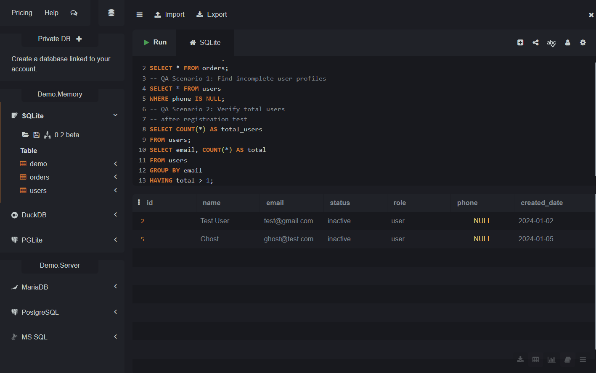

# QA SQL Data Validation Project

## Overview
As a QA Engineer, I created this project to simulate real SQL validation scenarios performed during a software testing lifecycle. I designed a custom e-commerce database with users and orders tables to reflect real application data and wrote 10 queries covering the complete QA testing cycle.

## Tools Used
- SQLite / MySQL Workbench
- SQL (DDL, DML, DQL)

## Database Design
| Table | Purpose |
|---|---|
| users | Stores registered user data |
| orders | Stores order transactions |

## QA Modules Covered

### Module 1 — User Validation
| Query | Scenario | Result |
|---|---|---|
| Missing phone | Found users with no phone number | Bug Found |
| Total users | Verified registration count | Pass |
| Duplicate emails | Checked for duplicate registrations | Pass |
| Inactive users | Identified inactive accounts | Pass |

### Module 2 — Order Validation
| Query | Scenario | Result |
|---|---|---|
| Failed orders | Found orders failing at checkout | Bug Found |
| High value pending | Found orders above 10000 stuck | Bug Found |
| Order summary | Generated status report for test cycle | Pass |

### Module 3 — Bug Investigation
| Query | Scenario | Result |
|---|---|---|
| Inactive user order | CRITICAL: Inactive user placed order | Bug Found |

### Module 4 — Test Data Cleanup
| Query | Scenario | Result |
|---|---|---|
| Reset order | Reset order status for regression test | Done |
| Delete failed | Cleaned up failed test data | Done |

## Key SQL Concepts Used
- SELECT, WHERE, AND, OR
- JOIN (INNER JOIN)
- COUNT, SUM, GROUP BY, HAVING
- UPDATE, DELETE
- NULL checks

## Sample Screenshot

## What I Learned
- How to validate backend data during QA testing
- Using JOIN to find critical bugs across tables
- Writing cleanup queries after test cycles
- Generating test summary reports using SQL

## Author
Vishnu Durga — QA Engineer
GitHub: github.com/VishnuDurgaCse
